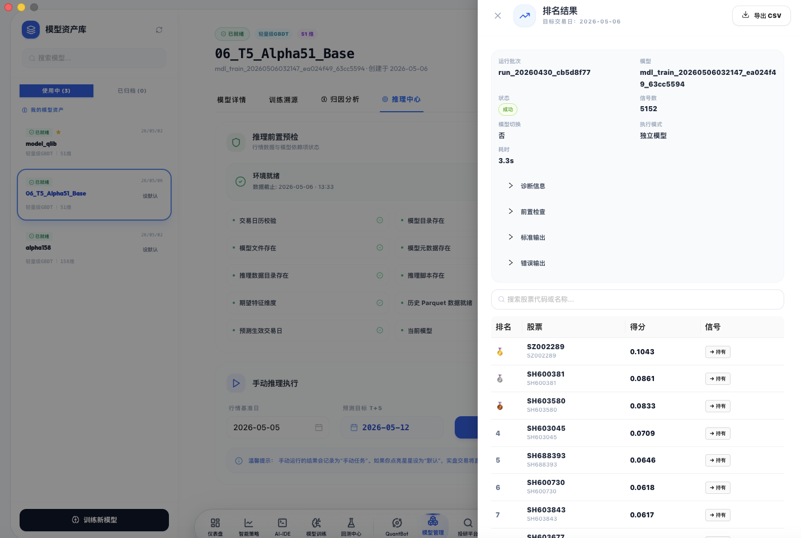
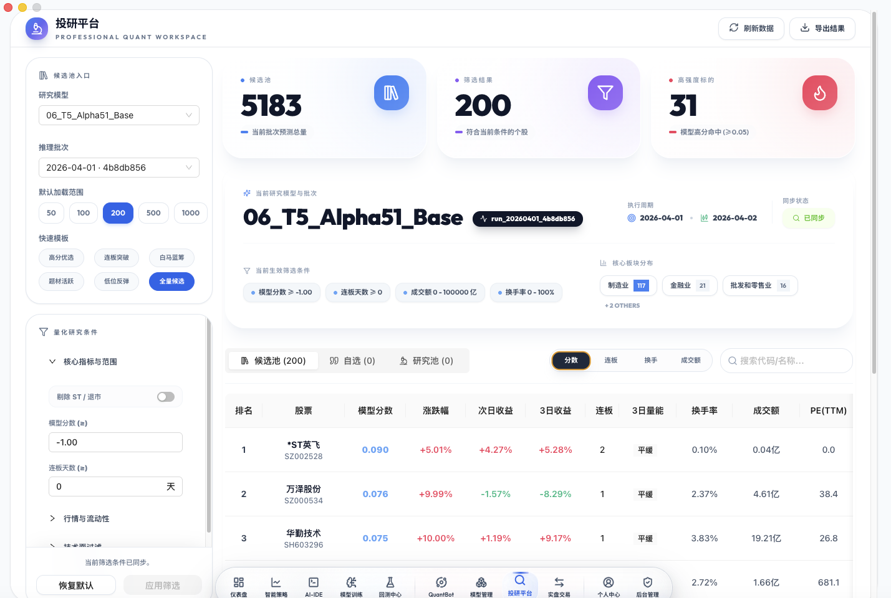

<p align="center">
  
</p>

<h1 align="center">QuantMind</h1>

<p align="center">
  <strong>新一代智能量化交易开源平台</strong>
</p>

<p align="center">
  打通 <b>数据 → 模型训练 → 回测 → 推理 → 实盘</b> 全流程闭环
</p>

<p align="center">
  <a href="#-快速开始">快速开始</a> •
  <a href="#-核心特性">核心特性</a> •
  <a href="#-技术架构">技术架构</a> •
  <a href="#-功能演示">功能演示</a> •
  <a href="#-文档导航">文档导航</a> •
  <a href="#-贡献">贡献</a>
</p>

<p align="center">
  
  
  
  
</p>

---

## ✨ 核心特性

### Qlib 内核驱动

基于微软 **Qlib** 量化框架深度集成，提供业界领先的量化研究能力：

- **LightGBM 模型** — 高性能梯度提升模型，专为金融时序预测优化
- **Alpha158 因子集** — 158 个经典量化因子，覆盖动量、估值、质量等多维度
- **自动化特征工程** — 51 维标准化特征，开箱即用

### 双引擎回测系统

独创 **Qlib + Pandas** 双引擎架构，灵活应对不同场景：

| 引擎 | 适用场景 | 性能 |
|------|----------|------|
| **Qlib Engine** | 复杂策略、多因子模型、机构级研究 | 极高性能 |
| **Pandas Engine** | 快速验证、简单策略、教学演示 | 轻量极快 |

### AI 模型全生命周期管理

从训练到推理，完整闭环：

- **一键训练** — 自动化特征提取、样本划分、超参优化
- **模型版本管理** — 多模型共存，一键切换
- **实时推理** — 每日自动生成交易信号

### RD-Agent 因子挖掘

集成微软 **RD-Agent**，AI 自主生成并进化量化因子：

- **自动因子演化** — 从 seed factors 出发，自动探索新因子
- **自动回测验证** — 生成的因子自动运行 Qlib 回测并保存结果
- **Chat 触发** — 通过 QuantBot 聊天即可启动因子挖掘任务

### QuantBot 智能助手

- **自然语言交互** — 用中文对话即可完成数据同步、回测、训练等操作
- **意图识别** — 自动识别用户意图并执行对应操作
- **QwenPaw 驱动** — 基于 agentscope/qwenpaw，支持多轮对话

### 实盘交易对接

- **QMT 券商** — 迅投 QMT 深度对接
- **模拟盘验证** — 实盘前完整模拟
- **风控系统** — 止损止盈、仓位控制、风险预警

---

## 🚀 快速开始

### 环境要求

| 组件 | 要求 |
|------|------|
| **操作系统** | Ubuntu 22.04+（推荐 Ubuntu 24.04 LTS） |
| **Docker** | 20.10+ |
| **Docker Compose** | 2.0+ |

### 硬件配置

| 功能模块 | 最低配置 | 推荐配置 |
|----------|----------|----------|
| 基础功能（智能策略、AI-IDE、回测中心、QuantBot） | 4核 8GB | 4核 16GB |
| 完整功能（含模型训练、模型推理、RD-Agent） | 8核 32GB | 16核 64GB |

### Step 1: 克隆项目

```bash
git clone https://gitee.com/qusong0627/quantmind.git
cd quantmind
```

> **重要**: 首次克隆后需要同步 RD-Agent 子项目：
> ```bash
> # 如果 RD-Agent 以 subtree 方式合并，确保 rd-agent/ 目录存在
> # 如果缺失，从 https://github.com/microsoft/RD-Agent 获取
> ```

### Step 2: 配置环境变量

```bash
cp .env.example .env
```

编辑 `.env` 文件，**必须修改以下配置**：

```bash
# 安全密钥（生产环境必须修改！）
SECRET_KEY=YOUR_OWN_SECRET_KEY
JWT_SECRET_KEY=YOUR_OWN_JWT_SECRET

# 数据库密码
DB_PASSWORD=YOUR_DB_PASSWORD
```

> 完整环境变量说明见 [.env.example](.env.example)

### Step 3: 配置 API Key（必选）

QuantBot、AI 策略生成、RD-Agent 因子挖掘等功能需要配置 API Key。

#### 方式 A: DeepSeek API Key（推荐）

1. 注册 [DeepSeek 平台](https://platform.deepseek.com/) 并获取 API Key
2. 在 `.env` 中配置：

```bash
AI_IDE_LLM_API_KEY=sk-YOUR_DEEPSEEK_API_KEY
AI_IDE_LLM_BASE_URL=https://api.deepseek.com
AI_IDE_LLM_MODEL=deepseek-v4-pro
```

#### 方式 B: Qwen / DashScope API Key

1. 注册 [阿里云 DashScope](https://dashscope.console.aliyun.com/) 并获取 API Key
2. 在 `.env` 中配置：

```bash
DASHSCOPE_API_KEY=sk-YOUR_DASHSCOPE_API_KEY
QWEN_API_KEY=sk-YOUR_QWEN_API_KEY
```

> 也支持任何 OpenAI 兼容接口的 API Key（如 OpenAI、本地 Ollama 等）

### Step 4: 启动服务

```bash
docker compose up -d
```

启动后等待服务就绪（约 30 秒）：

```bash
# 查看所有服务状态
docker compose ps

# 查看日志
docker compose logs -f quantmind
```

### Step 5: 初始化系统

```bash
# 安装 RD-Agent 模块 + 检查数据状态
docker exec quantmind bash /app/scripts/setup/init.sh
```

### Step 6: 初始化数据（首次使用必做）

QuantMind 需要历史行情数据才能运行回测和训练。有两种方式获取数据：

#### 方式 A: 使用离线数据包

1. 下载离线数据包：[https://oss.quantmindai.cn/data-download.html](https://oss.quantmindai.cn/data-download.html)
2. 安装方法详见：[docs/数据包安装指南.md](docs/数据包安装指南.md)

#### 方式 B: 从本地数据源同步

```bash
# 全量同步（从 parquet 源数据同步到数据库）
docker exec quantmind python /app/scripts/data/maintenance/sync_stock_daily_full.py

# Qlib 数据更新
docker exec quantmind python /app/scripts/daily_update.py --force
```

### Step 7: 访问系统

服务启动后访问：`http://<服务器IP>`

**默认管理员账号**: `admin` / `admin123`

> ⚠️ 首次登录后请立即修改默认密码

---

## 🏗️ 技术架构

### 服务拓扑

```
┌───────────────────────────────────────────────────────────────────┐
│                          客户端层                                  │
│              Electron Desktop  •  Web Browser                     │
└──────────────────────────┬────────────────────────────────────────┘
                           │
┌──────────────────────────▼────────────────────────────────────────┐
│                     API Gateway  (:8000)                           │
│  用户认证 • 策略管理 • 社区 • 管理后台 • QuantBot 代理            │
└─┬───────────┬───────────┬────────────────┬────────────────────────┘
  │           │           │                │
┌─▼────────┐┌▼──────────┐│┌───────────────▼────────────────────────┐
│ Engine   ││ Trade     │││  Stream                                │
│ (:8001)  ││ (:8002)   │││  (:8003)                               │
│ Qlib     ││ 订单管理   │││  实时行情 • WebSocket 推送              │
│ 回测     ││ 持仓管理   │││                                        │
│ AI 推理  ││ 风控       │││                                        │
│ RD-Agent ││           │││                                        │
└────┬─────┘└─────┬─────┘│└────────────┬───────────────────────────┘
     │            │      │             │
┌────▼────────────▼──────▼─────────────▼───────────────────────────┐
│                        数据层                                     │
│  PostgreSQL 15  •  Redis 7  •  Celery 队列  •  本地存储 /data    │
└──────────────────────────────────────────────────────────────────┘

┌──────────────────────────────────────────────────────────────────┐
│                    QwenPaw  (:8088 → 外部 :8089)                  │
│  QuantBot 聊天机器人 • 已挂载 QuantMind 代码库 + 数据 + Docker   │
└──────────────────────────────────────────────────────────────────┘

┌──────────────────────────────────────────────────────────────────┐
│                    RD-Agent (已安装至量化容器)                     │
│  因子演化 → 自动回测 → rd_agent_factors 表 → 结果查询             │
└──────────────────────────────────────────────────────────────────┘
```

### 端口映射

| 端口 | 服务 | 说明 |
|------|------|------|
| **8000** | API Gateway | 用户认证、策略管理、社区、管理后台 |
| **8001** | Engine | Qlib 回测、AI 策略生成、模型推理、RD-Agent |
| **8002** | Trade | 订单管理、持仓、风控 |
| **8003** | Stream | 实时行情、WebSocket 推送 |
| **5432** | PostgreSQL | 数据库 |
| **6379** | Redis | 缓存 / Celery 消息队列 |
| **8089** | QwenPaw | QuantBot 聊天机器人（外部访问） |

### 技术栈

| 层级 | 技术选型 |
|------|----------|
| **前端** | Electron + React 18 + TypeScript + Ant Design + Framer Motion |
| **后端** | Python 3.10 + FastAPI + SQLAlchemy (asyncpg) |
| **回测引擎** | Qlib + Pandas 双引擎 |
| **AI 模型** | LightGBM + Qlib Model Framework + RD-Agent |
| **数据库** | PostgreSQL 15（分区表） + Redis 7 |
| **消息队列** | Celery + Redis |
| **聊天机器人** | agentscope/qwenpaw |
| **容器化** | Docker + Docker Compose |

### 目录结构

```
quantmind/
├── docker-compose.yml          # Docker 服务编排（所有相对路径，任意目录可用）
├── .env.example                # 环境变量模板（复制为 .env 使用）
├── .gitignore                  # Git 忽略规则
├── LICENSE                     # AGPL v3 许可证
├── README.md                   # 本文档
├── CLAUDE.md                   # 项目开发指引
├── QUANTMIND_FRAMEWORK.md      # 完整框架文档（API + 数据流 + 调用方式）
│
├── backend/                    # Python 后端（FastAPI）
│   ├── main_oss.py             # 统一入口：SERVICE_MODE=all/api/engine/trade/stream
│   ├── run_tests.py            # 测试运行器（unit/integration/all）
│   │
│   ├── services/               # 四大服务实现
│   │   ├── api/                # API 网关 (:8000)
│   │   │   ├── main.py         # API 服务入口
│   │   │   ├── routers/        # 路由定义
│   │   │   │   ├── admin/      # 管理后台（需 admin 角色）
│   │   │   │   │   ├── dashboard.py        # 仪表盘统计
│   │   │   │   │   ├── model_management.py # 模型管理
│   │   │   │   │   ├── model_management_ops.py  # 数据管理操作
│   │   │   │   │   ├── admin_training.py   # 管理训练
│   │   │   │   │   ├── strategy_templates.py # 策略模板管理
│   │   │   │   │   └── users.py            # 用户管理
│   │   │   │   ├── auth.py                 # 登录/注册
│   │   │   │   ├── model_training.py       # 模型训练
│   │   │   │   ├── qwenpaw_proxy.py        # QwenPaw 代理
│   │   │   │   ├── profiles.py             # 用户画像
│   │   │   │   ├── research.py             # 投研平台
│   │   │   │   └── community/              # 社区功能
│   │   │   ├── models/                     # 数据库模型
│   │   │   └── user_app/                   # 用户应用（中间件、认证）
│   │   │
│   │   ├── engine/             # 引擎服务 (:8001)
│   │   │   ├── main.py         # Engine 服务入口
│   │   │   ├── routers/        # 路由
│   │   │   │   ├── rd_agent.py            # RD-Agent 因子提交
│   │   │   │   ├── quantbot_router.py     # QuantBot 聊天接口
│   │   │   │   └── model_training.py      # 模型训练路由
│   │   │   ├── qlib_app/       # Qlib 回测引擎
│   │   │   ├── ai_strategy/    # AI 策略生成
│   │   │   ├── quantbot/       # QuantBot 意图识别 + 任务调度
│   │   │   │   ├── intent_parser.py       # 意图识别
│   │   │   │   ├── rd_agent_launcher.py   # RD-Agent 启动器
│   │   │   │   └── task_store.py          # 任务存储
│   │   │   ├── inference/      # 模型推理服务
│   │   │   ├── training/       # 模型训练
│   │   │   └── tasks/          # Celery 异步任务
│   │   │       └── celery_tasks.py        # 回测/推理任务
│   │   │
│   │   ├── trade/              # 交易服务 (:8002)
│   │   │   ├── main.py         # Trade 服务入口
│   │   │   ├── runner/         # 交易执行器
│   │   │   │   └── main.py   # 主交易循环
│   │   │   ├── services/       # 交易业务逻辑
│   │   │   ├── portfolio/      # 投资组合管理
│   │   │   ├── simulation/     # 模拟交易
│   │   │   ├── routers/        # 交易路由
│   │   │   └── sandbox/        # 交易沙盒
│   │   │
│   │   ├── stream/             # 实时行情 (:8003)
│   │   │   ├── main.py         # Stream 服务入口
│   │   │   ├── market_app/     # 行情应用
│   │   │   │   └── services/   # 数据源（opentdx 等）
│   │   │   └── ws_core/        # WebSocket 核心
│   │   │
│   │   ├── ai_ide/             # AI-IDE 服务
│   │   └── tests/              # 服务集成测试
│   │
│   ├── shared/                 # 跨服务共享模块
│   │   ├── auth.py             # JWT 认证中间件
│   │   ├── database_manager_v2.py  # 数据库管理器（asyncpg）
│   │   ├── db_manager.py       # DB 连接池
│   │   ├── redis_client.py     # Redis 客户端
│   │   ├── trading_calendar.py # 交易日历（exchange_calendars）
│   │   ├── stock_utils.py      # 股票代码工具
│   │   ├── config.py           # 配置管理
│   │   ├── strategy_storage.py # 策略存储
│   │   ├── ai_providers/       # AI 提供商（DeepSeek/Qwen/OpenAI）
│   │   ├── backtest_engine/    # 回测引擎核心
│   │   ├── cache/              # 多级缓存
│   │   ├── dsl/                # 领域特定语言
│   │   ├── event_bus/          # 事件总线
│   │   └── schema/             # 数据 schema 定义
│   │
│   ├── config/                 # 配置文件
│   │   ├── settings.py         # 应用设置
│   │   └── users/              # 用户配置（QMT 等）
│   │
│   └── scripts/                # 后端工具脚本
│       ├── fill_sdl_from_parquet.py    # 从 parquet 填充 SDL
│       └── sync_official_data_update.py # 官方数据同步
│
├── electron/                   # Electron 前端（桌面应用）
│   ├── src/
│   │   ├── features/
│   │   │   └── quantbot/       # QuantBot 聊天功能
│   │   │       ├── pages/      # 页面组件
│   │   │       ├── components/ # UI 组件
│   │   │       └── services/   # API 服务
│   │   ├── store/              # Redux 状态管理
│   │   └── utils/              # 工具函数
│   └── package.json
│
├── docker/
│   ├── Dockerfile.oss          # 后端镜像构建
│   └── patch_qlib.py           # Qlib bug 修复补丁
│
├── scripts/                    # 运维脚本（均可独立运行）
│   ├── setup/
│   │   └── init.sh             # 系统初始化（安装 RD-Agent + 数据检查）
│   ├── eltdx_daily_update.py   # 通达信日 K 线增量更新
│   └── data/
│       ├── maintenance/
│       │   ├── sync_stock_daily_full.py       # 全量同步（parquet → DB）
│       │   ├── sync_qlib_from_fundamental_parquet.py  # Qlib 数据同步
│       │   ├── sync_parquets_from_remote_pg.py        # 远程数据库同步
│       │   └── backfill_financial.py           # 财务数据回填
│       └── processing/
│           └── backfill_return_fields.py       # 收益率字段回填
│
├── rd-agent/                   # RD-Agent（微软因子挖掘工具，需 git clone）
│   ├── rdagent/                # 核心代码
│   ├── requirements.txt        # 依赖
│   └── pyproject.toml          # 项目配置
│
├── requirements/               # Python 依赖拆分
│   ├── base.txt                # 基础依赖
│   ├── production.txt          # 生产环境
│   ├── ai.txt                  # AI 相关
│   ├── data.txt                # 数据相关
│   ├── database.txt            # 数据库相关
│   ├── auth.txt                # 认证相关
│   ├── dev.txt                 # 开发工具
│   └── trade.txt               # 交易相关
│
├── strategy_templates/         # 策略模板（11 个预置策略 .py + .json 配对）
├── db/                         # Qlib 数据 + parquet 源数据
│   ├── custom/
│   │   └── fundamental_aligned.parquet  # 720万行 × 88列
│   ├── qlib_data/              # Qlib 格式数据（日历、行情、特征）
│   └── feature_snapshots/      # 特征快照（model_features_*.parquet）
├── data/                       # 运行时数据
│   ├── 融资融券.json           # 融资融券股票池
│   ├── backtest_results/       # 回测结果
│   └── migrations/             # 数据库迁移记录
├── models/                     # AI 模型文件（按需下载/训练）
├── logs/                       # 日志
└── docs/                       # 详细技术文档（21+ 篇）
    ├── 部署指南.md
    ├── 数据包安装指南.md
    ├── 系统架构文档.md
    ├── 数据初始化指南.md       # 数据流转 + 初始化流程
    └── 智能体配置指南.md       # QuantBot/QwenPaw 配置
```

---

## 📸 功能演示

### 智能仪表盘

<p align="center">
  
</p>

实时监控账户状态、持仓盈亏、策略表现，一目了然。

### 快速回测

<p align="center">
  
</p>

分钟级完成策略回测，支持自定义参数、多标的组合、详细绩效报告。

### 模型训练

<p align="center">
  
</p>

可视化配置训练参数，自动完成特征工程、样本划分、模型训练与评估。

### 模型管理与推理

<p align="center">
  
  
</p>

多版本模型管理，一键切换生产模型，每日自动推理生成交易信号。

### 投研平台

<p align="center">
  
</p>

聚合展示候选股票、模型分数、涨跌幅与多周期收益，支持量化筛选与投研决策。

### 实盘交易与风控

<p align="center">
  
  
</p>

对接券商实盘，支持自动下单、持仓同步、止损止盈、黑名单管理。

### 高级分析

<p align="center">
  
</p>

深度策略分析：收益归因、风险分解、因子暴露、Benchmark 对比。

---

## 📚 文档导航

| 类别 | 文档 |
|------|------|
| **部署** | [部署指南](docs/部署指南.md) · [数据包安装](docs/数据包安装指南.md) · [Web 部署](docs/Web部署指南.md) |
| **开发** | [Electron 编译](docs/Electron编译方案.md) |
| **架构** | [系统架构](docs/系统架构文档.md) · [Qlib 架构](docs/Qlib架构与回测原理.md) · [完整框架文档](QUANTMIND_FRAMEWORK.md) |
| **策略** | [Alpha158 训练](docs/alpha158训练计划.md) · [策略比较](docs/策略比较分析.md) · [多模型切换](docs/多模型训练与推理切换设计方案.md) |
| **规范** | [Qlib 策略开发](docs/Qlib内部策略开发规范.md) · [回测费用](docs/回测费用配置说明.md) |
| **数据** | [高维特征存储](docs/高维特征存储与统一访问方案.md) · [152 维特征](docs/QuantMind_152维特征方案规范.md) · [stock_daily_latest 维护](docs/stock_daily_latest_维护文档.md) |

---

## 🛡️ 角色与权限

QuantMind 采用 **基于角色的访问控制（RBAC）**，通过 JWT Token 中的 `roles` 字段进行权限校验。

### 角色定义

| 角色 | 标识 | 权限范围 |
|------|------|----------|
| **管理员** | `admin` | 完整权限：用户管理、模型管理、数据管理、系统配置 |
| **普通用户** | `user` | 个人账户：策略管理、回测、训练、投研、社区 |

### 权限矩阵

| 功能模块 | admin | user | 未登录 |
|----------|-------|------|--------|
| 查看仪表盘 | ✅ | ✅（个人） | ❌ |
| 用户管理 | ✅ | ❌ | ❌ |
| 模型管理 | ✅ | ❌ | ❌ |
| 数据同步 | ✅ | ❌ | ❌ |
| 策略管理 | ✅ | ✅（本人） | ❌ |
| 回测 | ✅ | ✅ | ❌ |
| 模型训练 | ✅ | ✅ | ❌ |
| QuantBot 聊天 | ✅ | ✅ | ❌ |
| RD-Agent 因子挖掘 | ✅ | ✅ | ❌ |
| 投研平台 | ✅ | ✅ | ❌ |
| 社区浏览 | ✅ | ✅ | ✅（只读） |

### 认证方式

- **登录**: `POST /api/v1/auth/login` → 返回 JWT Token
- **认证**: 请求头携带 `Authorization: Bearer <token>`
- **管理接口**: 额外通过 `require_admin` 中间件校验 `roles` 包含 `admin`

### 默认管理员

```
用户名: admin
密码: admin123
角色: admin
```

> ⚠️ 首次部署后请立即修改默认管理员密码！

---

## 🧪 测试

```bash
# 单元测试
python backend/run_tests.py unit

# 集成测试
python backend/run_tests.py integration

# 全量测试
python backend/run_tests.py all

# QMT MVP 链路测试
python backend/run_tests.py trade-long-short
```

### 开发环境

```bash
# 后端开发
source .venv/bin/activate
pip install -r requirements.txt
SERVICE_MODE=api python backend/main_oss.py

# 前端开发（Electron）
cd electron && npm install && npm run dev

# 类型检查（前端）
cd electron && npm run typecheck

# 代码检查（后端）
ruff check backend/
ruff format backend/
```

---

## 🔧 常用运维命令

```bash
# 查看所有服务状态
docker compose ps

# 查看日志
docker compose logs -f quantmind

# 重启服务
docker compose restart quantmind

# 进入容器
docker exec -it quantmind bash

# 数据库连接
docker exec -it quantmind-db psql -U quantmind -d quantmind

# 安装/更新 RD-Agent
docker exec quantmind bash /app/scripts/setup/init.sh

# 数据全量同步
docker exec quantmind python /app/scripts/data/maintenance/sync_stock_daily_full.py

# Qlib 数据更新
docker exec quantmind python /app/scripts/daily_update.py --force
```

---

## 🤝 贡献

欢迎提交 Issue 和 Pull Request！

### 提交 Issue
- Bug 报告：请包含复现步骤、环境信息、日志
- Feature 请求：请描述使用场景和期望效果

### 提交 PR
1. Fork 本仓库
2. 创建特性分支 (`git checkout -b feature/amazing-feature`)
3. 提交更改 (`git commit -m 'Add amazing feature'`)
4. 推送到分支 (`git push origin feature/amazing-feature`)
5. 提交 Pull Request

---

## 📄 License

[GNU Affero General Public License v3.0](LICENSE)

---

## 🙏 致谢

### 核心框架

- [Qlib](https://github.com/microsoft/qlib) — 微软量化投资平台
- [RD-Agent](https://github.com/microsoft/RD-Agent) — 微软研发智能体
- [QwenPaw](https://github.com/agentscope-ai/qwenpaw) — 阿里 agentscope 智能对话框架（QuantBot 底层）
- [LightGBM](https://github.com/microsoft/LightGBM) — 微软梯度提升框架
- [FastAPI](https://fastapi.tiangolo.com/) — 现代高性能 Web 框架

### 数据源与工具

- [exchange_calendars](https://github.com/gerrymanoim/exchange_calendars) — 全球交易所交易日历（forked from quantopian/trading_calendars），覆盖 A 股、美股、港股、日股、韩股等多市场
- [investment_data](https://github.com/chenditc/investment_data) — 开源 A 股历史行情数据，提供完整的日线/分钟线/财务数据，支持 Qlib 格式
- [eltdx / opentdx](https://github.com/LisonEvf/opentdx) — 开源通达信行情数据接口（A 股日 K 线 + 实时行情）
- [pandas](https://pandas.pydata.org/) / [pyarrow](https://arrow.apache.org/) — 数据处理与 parquet 格式支持

| 数据源 | 说明 | 脚本 |
|--------|------|------|
| **investment_data** (chenditc) | 开源 A 股历史行情数据（parquet + Qlib 格式） | `scripts/data/maintenance/` 目录 |
| **通达信日 K** (eltdx) | 全 A 股每日增量更新（5000+ 股票，约 500MB/天） | `scripts/eltdx_daily_update.py` |
| **通达信实时行情** (opentdx) | 实时报价、盘口数据 | `backend/services/stream/market_app/services/opentdx_source.py` |
| **exchange_calendars** | 全球交易所交易日历（A 股 XSHG、美股 XNYS、港股 XHKG 等） | `backend/shared/trading_calendar.py` |
| **远程数据库** | 增量数据同步（通过 SOURCE_DATABASE_URL） | `scripts/data/maintenance/sync_parquets_from_remote_pg.py` |

---

## 💬 QQ 群

<p align="center">
  
</p>

---

<p align="center">
  <strong>QuantMind</strong> — 让量化交易更简单
</p>
