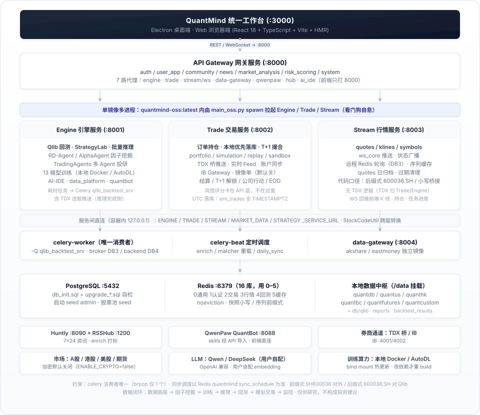
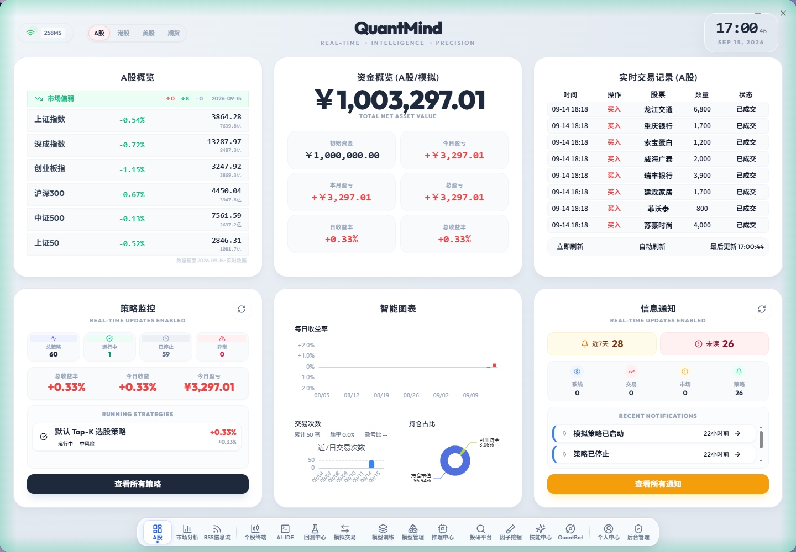
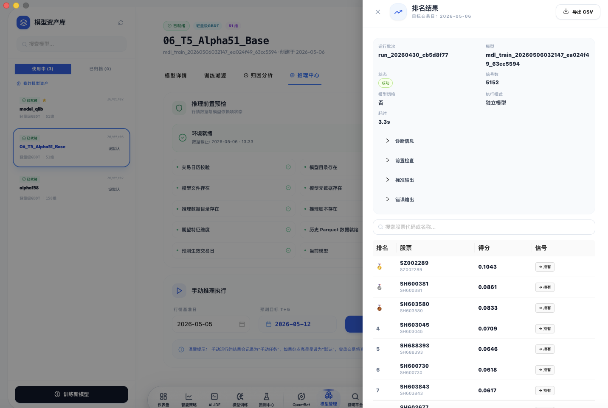

<div align="center">

# QuantMind (量化大脑) OSS

<p align="center">
  <strong>AI 原生 · 13 种模型工场 · 因子自主进化 · QMT/通达信实盘 · 工业级多市场量化投研平台</strong>
</p>

<p align="center">
  <a href="#项目简介">项目简介</a> •
  <a href="#系统架构">系统架构</a> •
  <a href="#核心特性">核心特性</a> •
  <a href="#快速部署">快速部署</a> •
  <a href="#产品预览">产品预览</a> •
  <a href="#本地开发">本地开发</a> •
  <a href="#交流社区">交流社区</a>
</p>

<p align="center">
  
  
  
  
  
  
</p>

</div>

***

## 项目简介

**QuantMind（量化大脑）** 是面向个人量化研究者、投研团队与专业机构的一体化 AI 原生量化交易平台。深度集成微软 **Qlib** 量化框架、**RD-Agent** 研发智能体与 **TradingAgents** 多 Agent 投研体系，全面打通量化全流程闭环：

```text
数据底座 -> 因子挖掘 -> 模型训练 -> 批量推理 -> 组合回测 -> QMT/通达信实盘 -> 生产监控
```

支持 **A 股、港股、美股、期货与区块链** 五大市场，帮助研究者摆脱繁琐的数据清洗与代码拼装，让模型自动从 300+ 维特征中挖掘 Alpha 规律。

***

## 系统架构

<p align="center">
  
</p>

***

## 核心特性

| 模块分类           | 核心能力与技术亮点                                                                                                                                                                                     |
| -------------- | --------------------------------------------------------------------------------------------------------------------------------------------------------------------------------------------- |
| **市场与数据**      | • 接入 QuantDB 数据中枢，内置 **300+ 维预计算特征**（L1/L2 微观结构与资金流） • 基于 **Parquet + DuckDB** 秒级列式存算，千万级行情秒级载入 • **7x24 RSS 舆情监控**：实时快讯流、事件实体自动匹配与利好/利空情绪量化                                                  |
| **因子自主进化**     | • 集成微软 **RD-Agent (AutoAlpha 2.0)** 自动化因子进化体系 • **LLM 自主演化流水线**：自然语言假设 ➔ 因子公式合成 ➔ 遗传演化回测 ➔ 优选入库                                                                                               |
| **13 种模型工场**   | • 覆盖经典树模型与深度学习：**LightGBM、XGBoost、CatBoost、GRU、LSTM、ALSTM、Transformer、TabNet、TCN、NativeTFT** 等 • 内置 **Optuna 自动化超参寻优** 与 **Stacking 多模型集成** • 算力无缝调度：支持本地 CPU/GPU 与一键推送到 **AutoDL 远程 GPU 集群** |
| **批量推理与信号**    | • 全市场每日批量截面打分、Top-N 潜力标的智能推荐与多信号动态融合 • **生产质量闭环**：每日真实 Rank IC/ICIR 自动回填、SHAP 特征重要性与数据漂移告警                                                                                                    |
| **微软 Qlib 回测** | • 高性能事件驱动回测引擎，支持 TopkDropout 等经典多因子选股策略 • 细粒度交易费率、滑点与涨跌停模拟，支持多维收益归因与风险指标全景展示                                                                                                                  |
| **QMT 实盘通道**   | • 原生对接券商 **MiniQMT (xtquant)**，配备 Windows 独立 QMT Agent 桌面客户端 • 采用**加密 WebSocket Bridge** 双向通信，支持同步/异步买卖、保护限价单与撤单防饥饿队列 • 账户资产与持仓秒级同步落库，完整支持柜台异步成交回报与断线看门狗自动重连                                  |
| **通达信深度联动**    | • 模型截面选股结果**一键推入通达信自定义板块** • 盘中实时预警雷达弹窗 + **双击闪电下单**（支持模拟盘与实盘双模式）                                                                                                                             |
| **模拟实盘与风控**    | • 本地 T+1 撮合机制、持仓与订单全生命周期管理 • 内置涨跌停限制、停牌过滤与开盘前实盘准备度预检（Preflight Check）                                                                                                                         |

***

## 快速部署

系统基于 Docker 容器化编排，推荐使用 **Ubuntu 22.04 / 24.04** 运行环境。

> 📖 **完整部署指南**（含在线/手动两种部署方式、`.env` 配置、QwenPaw 初始化、数据目录说明与常见问题排查）见 **[docs/部署指南.md](docs/部署指南.md)**。

### 1. 完整在线一键部署（主推 · 生产就绪）

从 CDN 下载**完整预构建镜像 + 业务数据 + 预训练模型 + Qlib 数据 + PostgreSQL 初始化备份**，校验后一次性恢复，部署完即可登录体验：

```bash
curl -fsSL https://gitee.com/qusong0627/QuantMind/raw/master/deploy/full-deploy.sh | sudo bash
```

部署完成后即可访问：

* **Web 控制台**: `http://<服务器 IP>:3000`

* **API 接口网关**: `http://<服务器 IP>:8000`

* **Swagger API 文档**: `http://<服务器 IP>:8000/docs`

### 2. 在线部署与平滑更新

```bash
# 在线部署
curl -fsSL https://gitee.com/qusong0627/QuantMind/raw/master/deploy/deploy.sh | sudo bash

# 已部署服务器一键更新（不清除数据库与模型资产）
sudo bash deploy/update.sh
```

### 3. 数据准备与 QuantDB 同步

系统正常运行（行情查询、模型训练、因子挖掘、回测）需要底层量化历史数据支持。**完整一键部署已内含基础业务数据**；若使用在线源码部署（不含数据），请选择以下任一方式准备数据：

> **方式一：QuantDB 在线下载及日常增量更新（推荐 · 最便捷）**
>
> * 登录系统后，在 **【个人中心】➔【数据平台】** 填入 QuantDB API Key 即可一键绑定与在线同步；
>
> * 或在服务器终端执行增量同步指令：
>
>   ```bash
>   docker exec quantmind python backend/scripts/quantdb_daily_sync.py
>   ```

> **方式二：QuantDB 离线数据包（备选 · 全量离线导入）**
>
> * 包含完整的 A 股量化历史行情、QuantDB 因子与 L1/L2 因子预计算数据（约 56 GB / 13 万文件）；
>
> * 下载链接：<https://pan.baidu.com/s/5IT4p5nFlglZ7zu_0H_fA8Q>
>
> * **解压到标准目录** `/opt/quantmind/data/quantdb/`（容器内通过 `./data:/data` 挂载读取 `/data/quantdb`），详细步骤见 [`docs/QuantDB_数据包解压指南.md`](docs/QuantDB_数据包解压指南.md)：
>
>   ```bash
>   cd /opt/quantmind/data/quantdb
>   7z x -y /path/to/quant_data.7z
>   ```

***

## 产品预览

QuantMind 将日常量化研究工作流整合在同一套现代化、响应灵敏的交互界面中：

### 1. 市场监控与资产看板

提供全市场行情大屏、资金流向、大盘指数热度与自选股盯盘。

<p align="center">
  
</p>

### 2. 市场分析与资金流向 (Market Analysis)

大盘全景、多周期资金流向、板块/个股资金链、申万行业热力矩形图谱与市场情绪温度计，全面洞察资金走向与未来趋势。

<p align="center">
  
</p>

### 3. 实时舆情与 RSS 资讯监控 (News & RSS Stream)

汇聚主流财经媒体 7x24 实时快讯、事件标签识别、利好/利空情绪分类与正文实体关联分析。

<p align="center">
  
</p>

### 4. AI-IDE 策略开发工作区

内置代码编辑器与量化 AI Copilot 助手，支持策略编写、语法检查、一键回测与云端发布。

<p align="center">
  
</p>

### 5. 微软 Qlib 回测中心 (Backtest Center)

基于微软 Qlib 引擎的高性能事件驱动回测，全面评估策略收益与最大回撤风险。

<p align="center">
  
</p>

### 6. AI 模型训练工场 (Model Training)

可视化配置训练参数，支持 13 种 ML/DL 算法，内置 Optuna 自动调参、WFA 滚动切分与本地/AutoDL 算力调度。

<p align="center">
  
</p>

### 7. 批量推理与选股信号中心 (Inference Hub)

支持全市场批量截面排序、Top N 标的推荐、信号动态融合与历史回溯。

<p align="center">
  
</p>

### 8. QuantaAlpha 智能因子挖掘平台

基于 LLM 驱动自主量化因子演化平台（AutoAlpha 2.0），用自然语言描述量化假设，AI 自动生成表达式与进化回测。

<p align="center">
  
</p>

***

## 本地开发

```bash
# 1. 后端单元测试
python backend/run_tests.py unit

# 2. 前端开发环境
cd electron
npm install
npm run dev          # 桌面端 (Electron)
npm run dev:web      # Web 模式
npm run typecheck    # TypeScript 类型检查
```

后端服务统一由 `backend/main_oss.py` 单入口编排启动：

* **API 服务** (`:8000`)：用户认证、策略管理、数据平台、模型管理、新闻代理

* **Engine 服务** (`:8001`)：Qlib 回测、AI 训练/推理、Alpha 因子挖掘、投研编排

* **Trade 服务** (`:8002`)：订单管理、持仓监控、模拟撮合、风控系统

* **Stream 服务** (`:8003`)：实时行情接收、WebSocket 推送网关

***

## 项目结构

```text
quantmind/
├── backend/                  # FastAPI 后端微服务与 Qlib 引擎
│   ├── main_oss.py           # 统一服务入口
│   ├── services/             # api / engine / trade / stream 四大服务
│   ├── shared/               # 跨服务共享模块 (DB/Redis/代码规范/日历)
│   └── scripts/              # 数据同步与特征计算脚本
├── electron/                 # Electron + React + TypeScript 桌面/Web 前端
├── tools/qmt_agent/          # Windows 独立 QMT Agent 桌面客户端与交易桥接
├── deploy/                   # 在线部署与一键更新脚本
├── docs/                     # 部署、架构与外部集成说明
├── scripts/                  # 按用途归档的开发、校验、数据与历史脚本
├── db/qlib_data/             # 本地 Qlib 格式二进制与 Parquet 数据
├── docker/                   # Dockerfile 镜像构建配置
└── docker-compose.yml        # 容器服务编排定义
```

> 详细文档参考：[部署指南](docs/部署指南.md) • [架构说明](docs/development/architecture.md) • [源码包部署](docs/deployment/source-bundle.md) • [通达信桥接](docs/integrations/tdx-bridge.md)

***

## 规范与贡献

* **代码规范**：Python 遵循 PEP8（使用 ruff 检查与格式化）；前端提交前请执行 `npm run typecheck`。

* **股票代码标准化**：所有内部 Redis 键、数据库字段及 API 参数**强制采用前缀格式**（如 `SH600036`、`SZ000001`、`BJ832000`）。

欢迎提交 Issue 与 Pull Request 共同建设！

***

## 免责声明

> **本项目仅供学习研究与技术演示，不构成任何投资建议。**
>
> * 本系统产出的所有分析报告和交易信号均由 AI 算法自动生成，可能存在误差或失效风险；
>
> * 实际投资决策请结合自身风险承受能力或咨询合规专业机构；
>
> * 作者与贡献者不对使用本开源软件产生的任何投资损失承担责任；
>
> * **股市有风险，入市需谨慎。**

***

## 致谢

* [Microsoft Qlib](https://github.com/microsoft/qlib) — 微软开源 AI 量化投资平台

* [Microsoft RD-Agent](https://github.com/microsoft/RD-Agent) — 微软研发智能体框架

* [TradingAgents-Astock](https://github.com/simonlin1212/TradingAgents-astock) — 多 Agent A 股投研框架

* [LightGBM](https://github.com/microsoft/LightGBM) / [CatBoost](https://github.com/catboost/catboost) / [XGBoost](https://github.com/dmlc/xgboost) — 经典梯度提升树算法

* [FastAPI](https://fastapi.tiangolo.com/) & [PyTorch](https://pytorch.org/) — 现代高性能后端与深度学习底座

***

## 交流社区

<p align="center">
  
  <br/>
  <b>QQ 交流群号：1029189565</b>
  <br/>
  <i>欢迎加入社群交流量化算法、模型调优与部署心得！</i>
</p>
